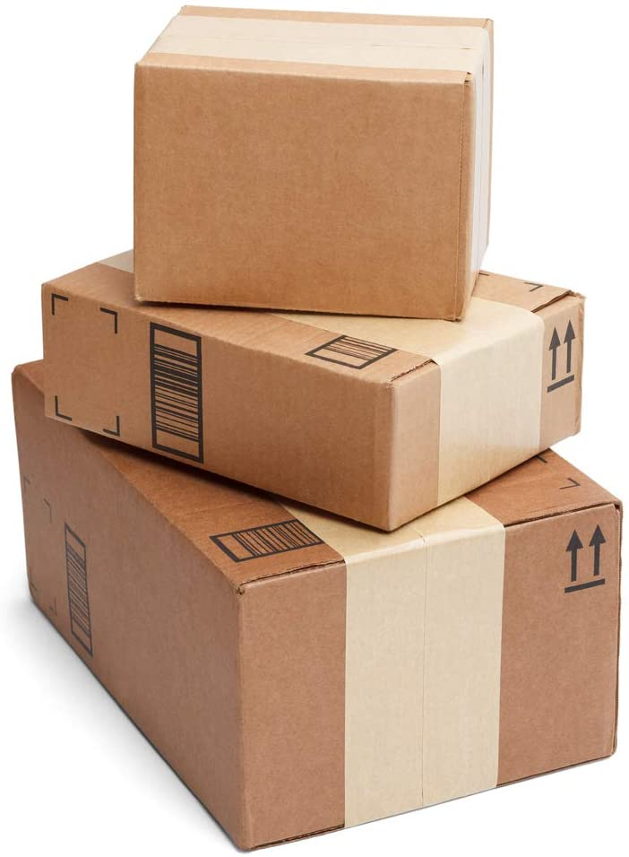
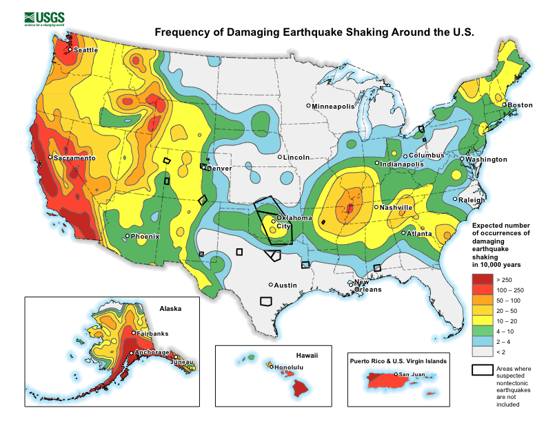
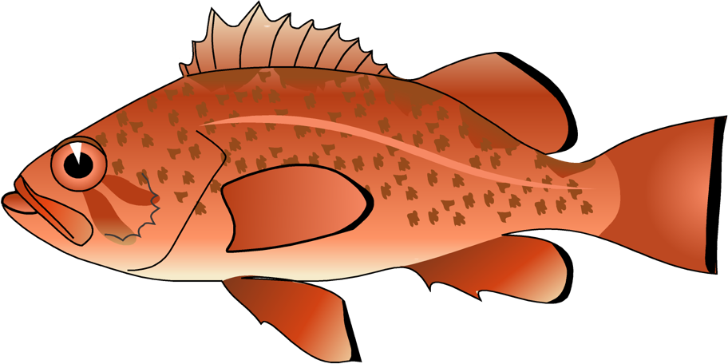
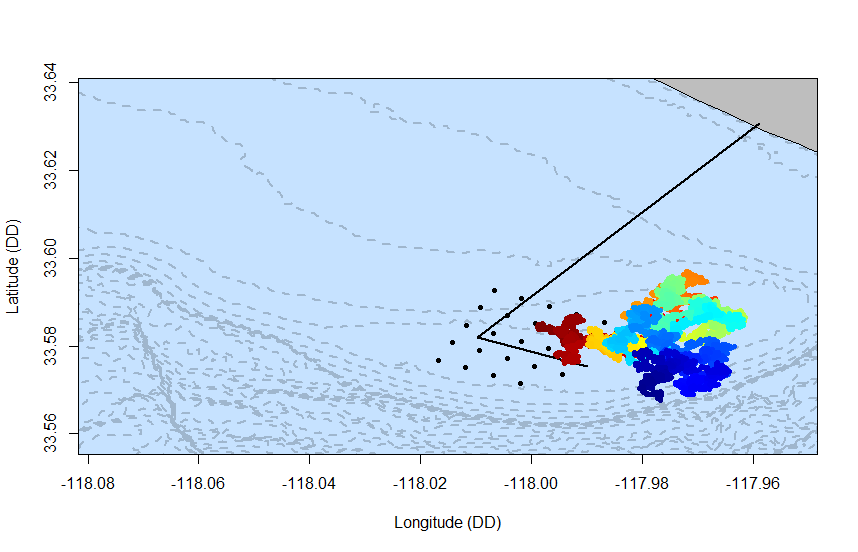

```{r setup, include=FALSE}
knitr::opts_chunk$set(echo = FALSE)
```

## Packages for This Presentation

In order of occurence:

- *rgdal* (reading in shapefiles)
- *fields* (color scheme)
- *geosphere* (calculating distance between points)
- *tidyverse* (mostly for ggplot)
- *maps* (for clean basemap)

<center></center>

## What is "geospatial" data? 

- Any data with that contains geographic coordinates (GPS)
- Can be tables, shapefiles, and even photographs
- Example: looking at maps to see the most recent earthquake

<center>

</center>

## Geospatial data can be tricky!

- Locations are usually given by two distinct numbers

<center>

</center>
</br>

- To designate direction: sometimes positive or negative numbers, sometimes positive numbers with N/S or E/W next to them! 

## Geospatial data can be tricky!

<center>

</center>
</br>
- To designate location: decimal degrees (DD), degrees minutes seconds (DMS), degrees minutes.minutes (DM.M), and sometimes even meters (*what?!*)

So... geospatial data can be <b>tricky</b>, and a bit sticky. But once you're used to it, it can be <b>*oh so satisfying*!</b>

## Geospatial Data and Science

- Tracking animals: *Where do they go? How do they interact with their environment?* (<b>today</b>)

<center>

</center>

- Tracking flight patterns: *Can an airline add more flights to their schedule?* 
- Predicting the next earthquake from previous earthquake locations
- and <b>*so much more*</b>!

## Imagine... 

You're a marine biologist, studying fish movement patterns.

<b>Research questions</b>

- *Are bottom-feeding fish spending time near a wastewater outfall?*
- *How close are these fish to the outfall pipe?*

<center>



</center>
<center><font size=1.5>Images courtesy of Dr. Larry Allen (CSU Northridge)</font></center>

<b>Implications:</b>

- Fish could be exposed to harmful contaminants
- Humans that eat these fish could also be exposed

## {data-background=presentation-images/huntington-map.png data-background-size=cover}

</br>
</br>
</br>
</br>
</br>
</br>
</br>
</br>
</br>
</br>
</br>
</br>

<font color="black" size=7> 
Your Study Site
</font>

<font color="black">A wastewater outfall ~5 mi offshore of Huntington Beach, CA</font>

## {data-background=presentation-images/acoustic-telemetry.png data-background-size=cover}
<font color="white" size=7>
<b>A Quick Intro into Acoustic Telemetry</b>
</font>

<font color="white"> 

- Fish are tagged with *transmitters* 
- Transmitters send out a sound that's heard by underwater </br> *acoustic receivers* 
- Receivers record the DateTime, receiver location, and </br> tag ID # of the fish that sent the signal
- If 3+ receivers are close together and hear the same fish </br> we can get the location of the fish too

</font>

## Start with the Basics

In your toolbox: 

- shapefile with wastewater outfall location
- shapefile with water depths (bathymetry)
- shapefile with US states (land masses)
- tagged fish locations

<center></center>

<b>*Wait, what's a shapefile?*</b>

- A set of geospatial files (.shp, .shx, .dbf, .prj) that can map themselves
- The set must stay together, or the file breaks, but you only open the .shp

## Start with the Basics 

<b>Step 1. </b>Load required packages.
```{r load, echo=TRUE, message=FALSE, warning=FALSE}
library(rgdal)
```

<b>Step 2. </b>Load shapefiles.
```{r echo=TRUE, message=FALSE, warning=FALSE, paged.print=FALSE}
outfall <- readOGR("sample-data/shapefiles/outfall-reproject.shp",
                   verbose=FALSE)
depths <- readOGR("sample-data/shapefiles/all-depths.shp", verbose=FALSE)
states <- readOGR("sample-data/shapefiles/us-states.shp", verbose=FALSE)
```


## Start with the Basics {.smaller}

<b>Step 3. </b>Check coordinate systems.
```{r, echo=TRUE}
proj4string(outfall)
proj4string(depths)
proj4string(states)
```
Oh no! *outfall* and *depths* are both "WGS84" (decimal degrees), but *states* is "NAD83" (meters)! 

## Start with the Basics

For all the layers to plot nicely on top of each other, they need to all be in the __same__ coordinate system. 

<b> Step 4. </b>Convert coordinate systems.
```{r, echo=TRUE}
states <- spTransform(states, proj4string(outfall))
```

Check that the projection has properly converted
```{r, echo=TRUE}
proj4string(states)
```

## Mapping to Validate Data

Now, we can quickly plot the data and see how it looks so far. 
```{r, echo=TRUE}
plot(depths, col="blue", lty=2)
plot(outfall, col="black", lwd=2, add=TRUE)
plot(states, col="gray", add=TRUE)
```

## Loading in Fish Locations

<b>Step 5: </b> Load in fish and receiver GPS points.

```{r, echo=TRUE}
receiver_locations <- read.csv("sample-data/csv/receiverlocs.csv")
fish_locations <- read.csv("sample-data/csv/location_data.csv")
```


```{r, echo=TRUE}
head(receiver_locations, n=2)
head(fish_locations, n=2)
```

## Re-Formatting 

For this plot, I want to be kind of fancy. 
</br>
I want the fish locations to be color-coded by time. 

```{r, echo=TRUE}
# First, make sure date/time are in POSIX format
fish_locations$times <- as.POSIXct(fish_locations$times, tz="UTC",
                                   format="%Y-%m-%d %H:%M:%S")
```

```{r, echo=TRUE}
# Then, convert to numeric so we can add a color scheme
fish_locations$numeric_time <- as.numeric(fish_locations$times)
```

## Time to Set Up a Pretty Plot

Load in color scheme package. 
```{r echo=TRUE, message=FALSE, warning=FALSE, paged.print=FALSE}
library(fields)
```

Set plot boundaries (trial and error)
```{r, echo=TRUE}
xlimits<-c(-118.076750, -117.953354) # only interested in this range of longitudes
ylimits<-c(33.558575, 33.637742) # and this range of latitudes
```

## The Final Plot Code {.smaller}

```{r, echo=TRUE, results="hide"}
# Set up empty plot
plot(receiver_locations$X, receiver_locations$Y, xlim=xlimits, 
     ylim=ylimits, xlab="Longitude (DD)", ylab="Latitude (DD)", type="n") 

# Create nice bluegray "base"
rect(par("usr")[1], par("usr")[3], par("usr")[2], par("usr")[4], col ="slategray1") 

# Add depth contours
plot(depths, col="slategray3", lwd=2, lty=2, add=TRUE)

# Add US states
plot(states, col="gray", add=TRUE)

# Add receiver locations
points(receiver_locations$X, receiver_locations$Y, pch=20) 

# Add outfall pipe
plot(outfall, lwd=2, add=TRUE)

# Re-introduce pretty boundary around the plot
rect(par("usr")[1], par("usr")[3], par("usr")[2], par("usr")[4], col ="NA") 

# Add fish locations, color-coded by time
points(fish_locations$LON, fish_locations$LAT, pch=20, 
       col=color.scale(fish_locations$numeric_time,zlim=range(fish_locations$numeric_time),
                        col=rev(tim.colors(256))))
```

## The Final Plot

<center></center>

## {data-background=presentation-images/by-outfall.png data-background-size=cover}

<font color="white" size=7><b>Well Done!</b></font>

<font color="white">
Now we can start looking at some characteristics. 
</br>
We can answer questions like:

- *Which depth contour is this fish spending most </br> of its time?*
- *How close is this fish to the outfall pipe?*

</font>

## "Which Depths?"

In *depths* shapefile, the "field_3" gives the depth in meters
</br>
Where -30 == 30 meters depth

```{r echo=TRUE, message=FALSE, warning=FALSE, paged.print=FALSE}
library(geosphere)
```
 
```{r echo=TRUE, message=FALSE, warning=FALSE}
# Grab random sample (for processing speed)
random_sample <- fish_locations[sample(nrow(fish_locations), 1000), ]

# Figure out the shapefile attribute that is closest to the fish gps point
distance_depths <- dist2Line(random_sample[,c("LON", "LAT")], depths)
distance_depths <- as.data.frame(distance_depths)

# Add depth column to random_sample that gives us the depth value
random_sample$depth <- depths$field_3[distance_depths$ID]
```

## "Which Depths?"

Plot it! 
```{r, echo=TRUE, fig.height=4, fig.align="center"}
distance_table <- as.data.frame(table(random_sample$depth))
barplot(height=distance_table$Freq, names.arg=rev(distance_table$Var1),
        col="darkorange4", main="", xlab="depth (m)", ylab="frequency")
```

## "How Close to the Outfall?"

Calculate the distance between fish locations and the nearest part of the outfall pipe.

```{r echo=TRUE, message=FALSE, warning=FALSE, paged.print=FALSE}
# Dist2Line to get distances
outfall_distance <- dist2Line(random_sample[,c("LON", "LAT")], outfall)

# Convert to data frame
outfall_distance <- as.data.frame(outfall_distance)

# Add distance (m) to the random sample data frame
random_sample$outfall_distance <- outfall_distance$distance
```

## "How Close to the Outfall?" {.smaller}

If this fish was using the outfall area a lot, we would see a distribution of distances that looks like this.

```{r, echo=TRUE, fig.height=4, fig.align="center"}
# Just generate some data
expected_hist <- rep(seq(0,2750,250), c(600, 500, 50, 30, 10, 5, 2, 1, 0, 0, 0, 0))

# Plot it
hist(expected_hist, col="gray", xlab="distance to outfall pipe (m)", main="", breaks=12, xlim=c(0,2750))
```

## "How Close to the Outfall?"

How do our data compare?
```{r, echo=TRUE}
# Round fish locations into 250 m groups
random_sample$outfall_distance <- floor(random_sample$outfall_distance/250)*250

# Generate expected and observed plots, but don't plot them yet
expected <- hist(expected_hist, breaks=12, plot=FALSE)
obs <- hist(random_sample$outfall_distance, breaks=12, plot=FALSE)
```

<center></center>

## "How Close to the Outfall?"

```{r, fig.align="center"}
# Time to plot
plot(expected, col="gray", main="", xlab="distance from outfall (m)", xlim=c(0,2750))
plot(obs, col="cornflowerblue", add=TRUE)
```

So, from this, it looks like this individual isn't regularly using the outfall pipe.

## Phew! Is there an easier way to mapping? {.smaller}

There always is an easier way. 

*ggplot* actually has some nice features for mapping. 

```{r echo=TRUE, message=FALSE, warning=FALSE}
library(tidyverse)
library(maps)
```

```{r, echo=TRUE}
# Get map of the world
world <- map_data("world")

# Create a ggplot map using this layer
worldplot <- ggplot() +
  geom_polygon(data = world, 
               aes(x=long, y = lat, group = group), fill="gray") + 
  coord_fixed(1, xlim = c(-119, -117), ylim = c(33,34)) +
  xlab("Longitude (DD)") + ylab("Latitude (DD)")

# Plot it
# worldplot
```

## Phew! Is there an easier way to mapping?


## Phew! Is there an easier way to mapping?

Let's add some fish data and re-plot it.

```{r, echo=TRUE, results="hide"}
# Add our fish data
layers <- worldplot + 
  geom_point(fish_locations, mapping = aes(x=LON, y=LAT), 
             color="darkorange", alpha=0.5)

# Create theme so background is blue like the ocean
new_theme <- theme(panel.background = 
                     element_rect(fill = "slategray1", colour = NA), 
        panel.grid.major = element_line(colour = NA),
        panel.grid.minor = element_line(colour = NA))

# Plot it
# layers + new_theme
```

## Phew! Is there an easier way to mapping?


## Phew! Is there an easier way to mapping? 

- *ggplot* is a lot like *matplotlib* in python
- Lots of little steps to create a nice plot
- But it gets pretty tricky when you're trying to add your own shapefiles or trying to have a very fine-scale spatial resolution

<center></center>

<center>__Leaflet for R is also so cool!__</center>

## Quick Recap

Mapping in R can be difficult, but geospatial data can answer some very interesting questions. 
</br>
</br>
Once you get the hang of it, mapping in R can be very rewarding! 


## {data-background=presentation-images/questions.jpg data-background-size=cover}

<font size=7 color="black"><b>Thank you!</b></font>

</br>
</br>
</br>
</br>
</br>
</br>
</br>
</br>
</br>
</br>
</br>
</br>
</br>

<font color="black">Twitter: echelle_burns</font>
